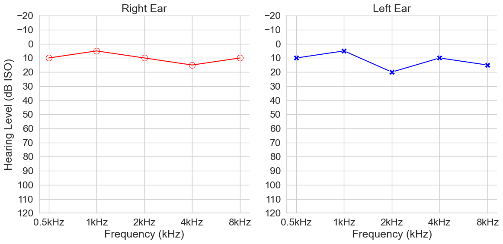
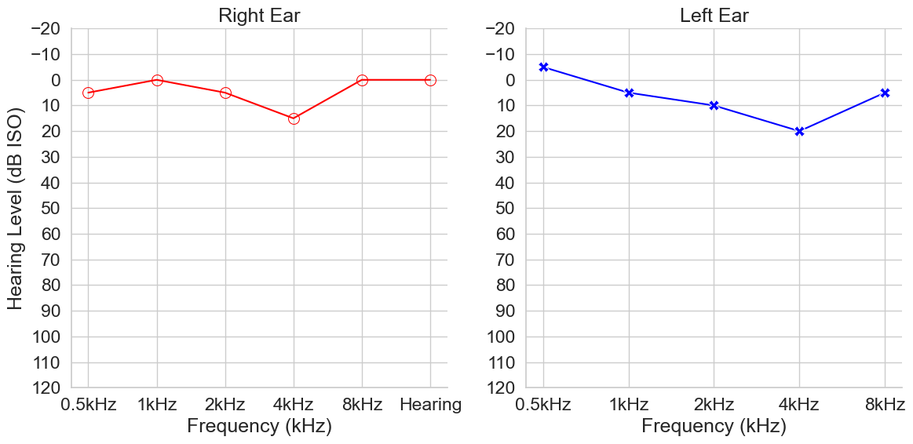

## Overview
Pure-tone audiometry (PTA) is a basic form of hearing test which assess hearing thresholds across various frequencies of sound. It is the gold standard for hearing tests and commonly used across the world. PTA's provide meaningful insights into an individual's hearing profile and can be used for diagnostics of possible types and sources of hearing loss. From this test, an audiogram can be generated which visualises an individual's hearing profile (Figure 1.). Audiogram curves are a crucial form of hearing health data.

**Fig 1.** Example audiogram curve from The National Health and Nutrition Examination Survey.

The National Health and Nutrition Examination Survey (NHANES) is the largest openly available dataset for pure-tone audiometry (PTA) data. Here, audiogram curves from NHANES 2011–2012, 2015–2016, and 2017–2020 were used to create a variational model of audiogram data. This model was sampled from, providing new, synthetic observations of audiogram data (Figure 2.). These data are statistically equivalent to the original data while also not being related to an actual individuals. A similar approach can be taken with University College London Hospital's (UCLH) data to provide synthetic versions of UCLH's audiogram data which is had risk of personal, private, or sensitive information leakage. This procedure generates data that cannot be used to identify an individual.

**Fig 2.** Example synthetic audiogram curve generate by model.

Note, this audiogram curve is "audiologically plausible" yet, is completely synthetic and does not pertain to any individual.

## Uses
We envision various uses for such as dataset:

1. Training and Education:
   Synthetic audiograms can be used to train audiology students, ENT residents, and other healthcare professionals. These artificial datasets can represent a wide range of hearing loss patterns, including rare or complex cases that may not be frequently encountered in clinical practice. This can help improve diagnostic skills and pattern recognition without relying on real patient data.

2. Algorithm Development and Testing:
   In the development of automated audiogram interpretation systems or AI-assisted diagnostic tools, synthetic data can be crucial. It allows researchers and developers to test and refine their algorithms on a diverse set of hearing loss patterns without the need for large amounts of real patient data, which can be difficult to obtain due to privacy concerns.

3. Research on Hearing Aid Fitting Algorithms:
   Researchers developing new hearing aid fitting algorithms can use synthetic audiogram data to test and refine their methods. This allows for the evaluation of fitting strategies across a wide range of hearing loss configurations without the need for extensive clinical trials in the early stages of development.

4. Predictive Modeling:
   Synthetic audiogram data could be used to develop predictive models for hearing loss progression. These models could help clinicians anticipate future changes in a patient's hearing based on current audiometric data and other factors, potentially allowing for earlier interventions.

In all these applications, synthetic audiogram data provides a valuable resource for advancing audiology practice, research, and education while maintaining patient privacy and overcoming limitations in data availability. The goal is to improve the speed, accuracy, and accessibility of hearing healthcare.

## Limitations
The synthetic data only has air-conduction measures. Further work is required to generate synthetic bone-conduction measures.

You can see the full data specification at [Alchemist/Critical Care](https://uclh-criu.github.io/hic-alchemist-docs/).